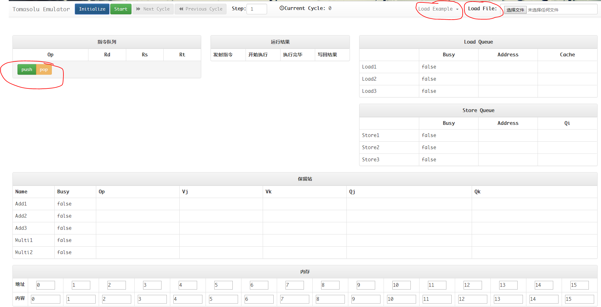
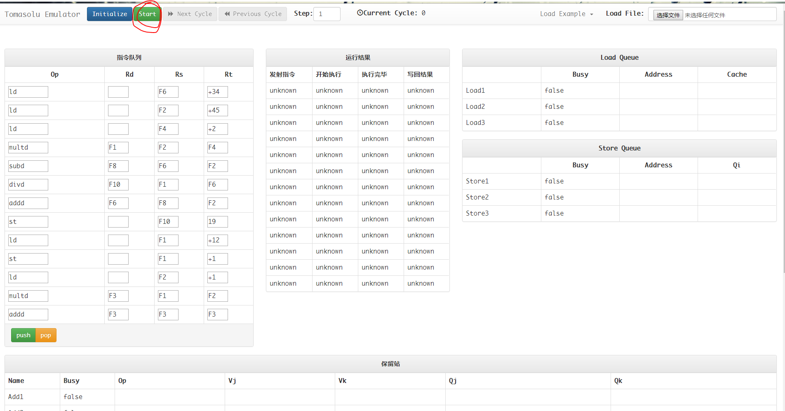
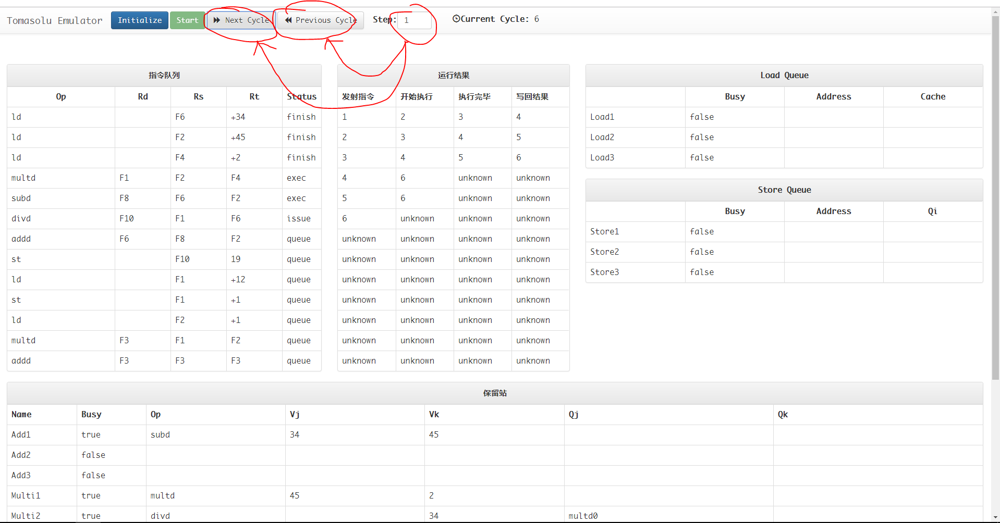

# Tomasulo算法实验报告

李则言 2014011292  吕鑫  2014011298  卫翔宇 2014011312

---

## 一、环境配置

### 1.环境列表

任何一个浏览器（部分老旧的浏览器可能不支持），建议使用最新版的Chrome。

### 2.运行方法

1. 使用浏览器打开`index.html`。

2. 加载指令。

   点击右上角的`load example`可以加载预设的测试程序，点击左侧红圈中的`push`或者`pop`可以手动添加或者删除指令，然后编辑指令。

   点击`Load File`可以从文本文件中加载指令序列。指令序列文件的格式示例(**浮点操作指定的格式为op rd,rs,rt**)（`example1.txt`）:

   ```
   ld F6, 34
   ld F2, 45
   ld F10, 5
   addd F2, F1, F6
   st F10, 1
   st F2, 1
   ```

   所有的加载操作都是在已有的指令序列后面追加上指令序列，如果要清除所有指令可以点击`initialize`。

   

3. 开始执行。

   点击顶部操作栏中的`start`按钮进入执行状态，此时将不能再修改指令。

   

   然后可以点击顶部操作栏中的`next cycle`和`previous cycle`单步调试FPU的执行。右侧`step`表示每次点击按钮移动的时钟数目。`current cycle`表示当前的时钟数。

   

   在“内存”一栏输入任意地址即可查询这一地址的值，每个内存单元的初始值和地址是相同的。可以直接修改内存单元的值。

   在“指令序列”一栏鼠标悬停可以直接看到寄存器的表达式和值。

4. 重新初始化

   点击顶部操作栏中的`initialize`将初始化程序，此时所有的状态和指令将被清除，可以重新编辑指令。

### 3.单元测试

打开`index.html`会自动执行单元测试，测试的内容是所有`load example`中出现的测试程序。

单元测试函数在`tomasolu-core.js`文件结尾处，可以在此查看我们对测试程序的所有断言。

单元测试失败将在控制台输出错误信息。

## 二、代码结构

`tomasolu-core.js`是Tomasulo算法的核心部分，按照要求实现了完整的算法流程。

`tomasolu-view.js`主要实现了交互界面的逻辑。`index.html`和`index.css`实现了交互界面的样式。

`./lib/`中是所有引用的第三方库。

## 三、核心算法实现介绍

### 1.Instruction类

此类代表一条指令

`status`为指令当前的运行状态，有queue、issue、exec/load/store、exec_finish/load_finish/store_finish、finish这几种状态。其中queue表示还在指令队列，未被发送，issue表示这个周期被发送，exec/load/store分别表示指令正在计算（运算指令）、加载（load指令）和存储（store指令），exec_finish/load_finish/store_finish分别表示指令计算完成、加载完成和存储完成，finish表示指令写回完成，全部执行结束。

`status_change_time`是一个列表，存储指令各种事件的时间，分别是发射指令时间(键为issue_time)，开始执行时间(键为exec_time)，执行完毕时间(键为finish_time)，写回结果时间(键为write_time)。

### 2.ReservationContent类

此类代表一个加减或乘除保留站

`name`表示这个保留站的名字，如Add1。

`running`表示这个保留站对应的指令是否正在运算器中执行

`satisfy`表示这个保留站所需要的寄存器是否都已经满足

`compute_time`表示这个保留站对应的指令已经运算的时间

`rank`表示这个保留站在保留站集合的第几位

`ans`表示这个保留站对应的指令的运算结果

### 3.ReservationStation类

此类代表一个加减乘除保留站集合

`add_size`表示加减保留站的数目，按照要求取3

`multi_size`表示乘除保留站的数目，按照要求取2

`add_used`表示已经使用的加减保留站的数目

`multi_used`表示已经使用的乘除保留站的数目

（注我们支持多个拥有加减或乘除运算器，`add_compute_num`和`multi_compute_num`分别代表加减和乘除运算器的个数，按照课件要求可以全部取1）

`add_compute_work`为一个数组，表示全部的加减运算器的运行状态，为-1代表闲置，为其他值i代表被第i个加减保留站占用计算资源

`multi_compute_work`为一个数组，表示全部的乘除运算器的运行状态，为-1代表闲置，为其他值i代表被第i个乘除保留站占用计算资源

`add_reservation_stations`为一个数组，表示全部的加减保留站，数组大小按照要求为3

`multi_reservation_stations`为一个数组，表示全部的乘除保留站，数组大小按照要求为2

`is_free`函数，根据指令的形式判断是否有空的保留站

`issue`函数，发射一条指令，并为这条指令分配初始化一个保留站

`work`函数，进行更新保留站寄存器，释放已经结束的指令的计算资源，分配新的计算资源等处理

`write_back`函数，将计算结束的结果写回，并更新所有同名的需要更新qj,qk

### 4.MemoryBufferContent类

此类代表一条Memory Buffer中的内容，也即一条指令及其状态的集合。

`ins`表示此Memory Buffer条目中的指令

`name`表示这个指令的名字，如ld1

`running`表示该指令是否正在执行

`busy`表示该Memory Buffer条目的busy状态

`satisfy`表示该指令运行所需的寄存器条件是否已得到满足

`data`表示这条访存指令读取或写入的数据

`issue_time`表示这条指令issue的时间

`begin_time`表示这条指令开始执行的时间

`rank`表示这个Memory Buffer条目在Memory Buffer的第几位

`exp`表示这条访存指令使用的寄存器中可能存在的表达式

### 5.MemoryBuffer类

此类代表一个加减乘除保留站集合

`load_buffer_size`表示Load Buffer的容量，按照要求取3

`store_buffer_size`表示Store Buffer的容量，按照要求取3

`load_buffer_used`表示已经使用的Load Buffer的条目数

` store_buffer_used`表示已经使用的Store Buffer的条目数

`load_buffer`为一个数组，其中对象的类型为MemoryBufferContent，表示全部的Load Buffer条目，数组大小为3

`store_buffer`为一个数组，其中对象的类型为MemoryBufferContent，表示全部的Store Buffer条目，数组大小为3

`is_free`函数，根据指令是load还是store判断对应buffer是否有剩余空间

`issue`函数，发射一条指令，并为这条指令分配并初始化一个Memory Buffer条目

`work`函数，对于在Memory Buffer中的每条指令，判断其执行条件是否已得到满足，若已得到满足则执行指令

`write_back`函数，将访存指令的结果写入寄存器或内存，并从Memory Buffer中去掉对应指令，腾出空间

## 四、前端实现介绍

基于Vue.js实现。

下面是页面的主体结构，其中`tomasolu-view`是通过Vue.js自定义的html标签。

``` html
<div id="te-view-div">
    <tomasolu-view></tomasolu-view>
</div>
```

Vue.js通过双向数据绑定，可以直接将`tomasolu-core.js`中实现的`FPU`数据显示出来，也可以很方便地直接在前段修改指令和内存的内容。

向前执行一条指令直接调用`FPU`的`cycle_pass()`接口即可。向后的时钟移动将重新初始化`FPU`,然后从零时刻重新开始执行到目标时刻，因此向后的时钟移动是非常消耗资源的。

## 五、测试与验证

### TestCase1

``` javascript
Instruction("ld", "F6", "+34", ""),
Instruction("ld", "F2", "+45", ""),
Instruction("ld", "F10", "+5", ""),
Instruction("addd", "F1", "F6", "F2"),
Instruction("st", "F10", "+1", ""),
Instruction("st", "F2", "+1", ""),
```

``` javascript
assert_register_value(fpu, "F6", 34);
assert_register_value(fpu, "F10", 5);
assert_register_value(fpu, "F2", 34);
assert_memory_value(fpu, 1, 34);
assert_memory_value(fpu, 2, 2);
assert_memory_value(fpu, 45, 45);
assert_memory_value(fpu, 34, 34);
```

这个测例主要是验证`ld`和`st`指令功能实现的正确性，即能不能正确地进行内存读写。

### TestCase2

```JavaScript
Instruction("ld", "F6", "+34", ""),
Instruction("ld", "F2", "+45", ""),
Instruction("ld", "F4", "+2", ""),
Instruction("multd", "F2", "F4", "F1"),
Instruction("subd", "F6", "F2", "F8"),
Instruction("divd", "F1", "F6", "F10"),
Instruction("addd", "F8", "F2", "F6"),
Instruction("st", "F10", "19", "")
```

``` javascript
assert_register_value(fpu, "F6", 34);
assert_register_value(fpu, "F4", 2);
assert_register_value(fpu, "F2", 45);
assert_register_value(fpu, "F1", 90);
assert_register_value(fpu, "F8", -11);
assert_register_value(fpu, "F10", 90 / 34);
assert_register_value(fpu, "F6", 34);
assert_memory_value(fpu, 19, 90 / 34);
```

这个测例主要验证了四条算术指令实现的正确性，即能不能正确地进行浮点运算。

### TestCase3

``` javascript
Instruction("ld", "F1", "+12", ""),
Instruction("st", "F1", "+1", ""),
Instruction("ld", "F2", "+1", ""),
Instruction("multd", "F1", "F2", "F3"),
Instruction("addd", "F3", "F3", "F3"),
```

``` javascript
assert_memory_value(fpu, "1", 12);
assert_register_value(fpu, "F3", 288);
```

这个验证了内存和寄存器的写后读冲突是否能够解决。

### TestCase4

```javascript
Instruction("ld", "F1", "+12", ""),
Instruction("st", "F1", "+1", ""),
Instruction("ld", "F2", "+1", ""),
Instruction("st", "F3", "+1", ""),
Instruction("multd", "F1", "F2", "F3"),
Instruction("multd", "F3", "F3", "F3"),
Instruction("st", "F3", "12", ""),
Instruction("addd", "F3", "F3", "F3"),
```

``` javascript
assert_memory_value(fpu, 12, 144 * 144);
assert_register_value(fpu, "F3", 144 * 144 * 2);
```

这个验证了内存和寄存器的读后写冲突能不能解决。

### TestCase5

```javascript
new Instruction("ld", "F6", "+25", ""),
new Instruction("ld", "F2", "+35", ""),
new Instruction("ld", "F4", "+2", ""),
new Instruction("multd", "F2", "F2", "F2"),
new Instruction("addd", "F2", "F4", "F4"),
new Instruction("divd", "F2", "F6", "F6"),
new Instruction("subd", "F2", "F4", "F6"),
```

```javascript
assert_register_value(fpu, "F2", 35 * 35);
assert_register_value(fpu, "F4", 35 * 35 + 2);
assert_register_value(fpu, "F6", -2);
```

这个验证了多重运算冲突能否解决

### TestCase6

```javascript
new Instruction("ld", "F6", "+7", ""),
new Instruction("st", "F6", "+7", ""),
new Instruction("st", "F2", "+5", ""),
new Instruction("ld", "F2", "+5", ""),
new Instruction("st", "F2", "+7", ""),
```

```javascript
assert_register_value(fpu, "F2", 0);
assert_register_value(fpu, "F6", 7);
assert_memory_value(fpu, 5, 0);
assert_memory_value(fpu, 7, 0);
```

这个验证了多重存储冲突能否解决

## 六、备注

1.按照助教邮件的回复，因为已经实现了，就没有使用流水线，而是前一条指令执行完了，后一条指令才可以继续使用计算资源，并不能同时使用。（但是实现了扩展，支持多加减或乘除器，这样可以同时在不同的运算器中计算，只是默认设置没有打开这样功能）。

2.与课件上相似，在issue的那个周期，即使运算器空闲，保留站有位置也不可以运行，这即是issue需要占用一个运行周期。

3.在一个周期内应该是先写回，再进行其他操作，类似于在第5个周期，第3个指令要写回寄存器F1，这样在第5个周期其他需要F1的指令都可以得到更新，即第5个周期便能用最新的F1的值。

4.指令的rs，rt，rd的意义是rs op rt -> rd，即是rs和rt操作，存入rd中。

5.对于load和store，在没有冲突的情况下是会并行执行的，而若有冲突，则会进行阻塞。